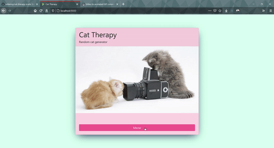

# cat-therapy-scala

Simple Scala Play app to display randomised cat photos 😃

Uses [The Cat API](https://thecatapi.com/) to source the random images.

## Dependencies

### Scala Build Tool 'sbt'
[Download and install sbt](https://www.scala-sbt.org/)

## Running
Use `sbt run` to run the application on `http://localhost:9000/`

